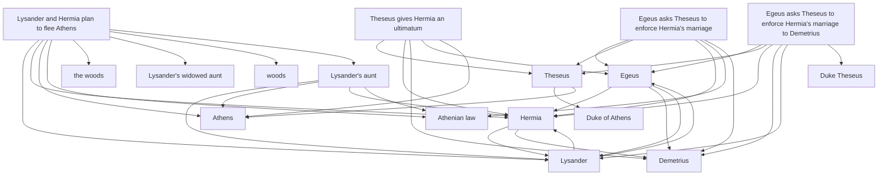

```mermaid
graph TD;
  Demetrius["Demetrius"]
  Theseus["Theseus"]
  Athens["Athens"]
  Egeus["Egeus"]
  EgeusasksTheseustoenforceHermiasmarriage["Egeus asks Theseus to enforce Hermia's marriage"]
  Lysanderswidowedaunt["Lysander's widowed aunt"]
  Athenianlaw["Athenian law"]
  EgeusasksTheseustoenforceHermiasmarriagetoDemetrius["Egeus asks Theseus to enforce Hermia's marriage to Demetrius"]
  thewoods["the woods"]
  TheseusgivesHermiaanultimatum["Theseus gives Hermia an ultimatum"]
  DukeofAthens["Duke of Athens"]
  LysanderandHermiaplantofleeAthens["Lysander and Hermia plan to flee Athens"]
  Hermia["Hermia"]
  woods["woods"]
  Lysandersaunt["Lysander's aunt"]
  Lysander["Lysander"]
  DukeTheseus["Duke Theseus"]
  Theseus --> DukeofAthens
  Theseus --> Athens
  TheseusgivesHermiaanultimatum --> Theseus
  TheseusgivesHermiaanultimatum --> Hermia
  TheseusgivesHermiaanultimatum --> Demetrius
  Lysander --> Hermia
  Lysander --> Egeus
  EgeusasksTheseustoenforceHermiasmarriage --> Egeus
  EgeusasksTheseustoenforceHermiasmarriage --> Theseus
  EgeusasksTheseustoenforceHermiasmarriage --> Hermia
  EgeusasksTheseustoenforceHermiasmarriage --> Athenianlaw
  EgeusasksTheseustoenforceHermiasmarriage --> Demetrius
  LysanderandHermiaplantofleeAthens --> Lysander
  LysanderandHermiaplantofleeAthens --> Hermia
  LysanderandHermiaplantofleeAthens --> Athens
  LysanderandHermiaplantofleeAthens --> Athenianlaw
  LysanderandHermiaplantofleeAthens --> thewoods
  LysanderandHermiaplantofleeAthens --> Lysanderswidowedaunt
  Lysandersaunt --> Lysander
  Lysandersaunt --> Athens
  Lysandersaunt --> Hermia
  Lysandersaunt --> Athenianlaw
  Egeus --> Hermia
  Egeus --> Demetrius
  Egeus --> Lysander
  Hermia --> Lysander
  Hermia --> Demetrius
  TheseusgivesHermiaanultimatum --> Egeus
  TheseusgivesHermiaanultimatum --> Athens
  EgeusasksTheseustoenforceHermiasmarriagetoDemetrius --> Egeus
  EgeusasksTheseustoenforceHermiasmarriagetoDemetrius --> Theseus
  EgeusasksTheseustoenforceHermiasmarriagetoDemetrius --> Hermia
  EgeusasksTheseustoenforceHermiasmarriagetoDemetrius --> Demetrius
  EgeusasksTheseustoenforceHermiasmarriagetoDemetrius --> Lysander
  EgeusasksTheseustoenforceHermiasmarriagetoDemetrius --> DukeTheseus
  LysanderandHermiaplantofleeAthens --> woods
  LysanderandHermiaplantofleeAthens --> Lysandersaunt
```