# Case Study: A Midsummer Night's Dream

This page demonstrates Marvin's end-to-end capabilities, illustrating how an agent's ephemeral interactions are mathematically graphed, structurally verified, and automatically consolidated into a rich Obsidian knowledge base.

## The Experiment

We simulated an extreme conversational flow where an agent is instructed to read massive chunks of Shakespeare's *A Midsummer Night's Dream* and autonomously decide what to remember.

During the session, the agent:
1. **Processed** thousands of tokens of raw text.
2. **Autonomously logged** three distinct episodic summaries of the opening act.
3. **Triggered Computational Sleep** to distill the narrative into permanent facts and processing rules without any human guidance.

## Step 1: Agentic Worktrees & Episodic Logging

Because analyzing a dense literary text is a complex task, the agent first used Marvin to check out a dedicated Git "Worktree" (branch) named `session-reading`.

As the agent answered the user's question, it logged its thought process into an **Episodic** memory. Simultaneously, Marvin's background worker (powered by Google's `langextract`) intercepted the raw text and successfully identified the characters without any prior training:

```markdown
# Analyzed Act 1 Marriage Laws

## Summary
Answered question about Hermia's suitors and Athenian law.

## Details
Read Act 1. Found that:
[[Hermia]]’s two suitors are [[Lysander]] and [[Demetrius]].

- [[Lysander]] loves [[Hermia]], and [[Hermia]] loves him.
- [[Demetrius]] also seeks to marry [[Hermia]], and [[Egeus]], her father, wants her to marry [[Demetrius]].

The Athenian law, as explained by [[Theseus]], is that [[Hermia]] must obey her father’s choice. If she refuses to marry [[Demetrius]], she faces either:

1. **Death**, according to the law of [[Athens]], or  
2. **A life of chastity in a nunnery** (“on [[Diana]]’s altar”).

So, [[Hermia]] is legally expected to marry the man her father chooses, not necessarily the one she loves.

## Related
- [[Lysander]]
- [[Demetrius]]
- [[Egeus]]
- [[Theseus]]
- [[Hermia]]
- [[Athens]]
- [[Diana]]
```

Notice how `langextract` perfectly identified the proper nouns and automatically wrapped them in Obsidian `[[wikilinks]]`. 

### The K-Lines Philosophy: Implicit vs. Explicit Entities
You might notice that we didn't automatically create separate Markdown files for each entity (e.g., a file specifically named `Theseus.md`). This is a deliberate choice consistent with the **K-Lines architecture**:

In biological memory, an entity (a K-Line) is not a standalone "file" with a definition; it is defined entirely by the *connections* it makes to other memories. In Marvin, when the agent searches for `Theseus`, the SQLite full-text and vector index instantly retrieves the cluster of Episodic and Semantic notes where `[[Theseus]]` is linked. The entity exists as a structural node within the graph, avoiding the clutter of thousands of empty "placeholder" files in your Obsidian vault. If an agent explicitly wants to define Theseus, it simply calls `marvin_remember_semantic("Theseus", "Duke of Athens")`.

## Step 2: Extracting Rules and Preferences

During the session, the agent also used its tools to fulfill the user's direct commands.

It successfully stored the user's preference as a **Semantic** memory:
```markdown
# User Preferences

## Facts
- The user's favorite character in [[A Midsummer Night's Dream]] is [[Nick Bottom]].

## Related
- [[Nick Bottom]]
- [[A Midsummer Night's Dream]]
```

And it stored the new behavioral command as a **Procedural** memory:
```markdown
# Play Analysis Strategy

## Procedure
1. Identify the [[ruler]] or [[[[authority]] figure]] in the [[scene]].
2. Identify who is petitioning the [[authority]].
3. Map out the [[power dynamics]] before analyzing [[character emotions]].

## Related
- [[authority figure]]
- [[ruler]]
- [[power dynamics]]
- [[scene]]
- [[character emotions]]
- [[authority]]
```

## Step 3: Computational Sleep (Consolidation)

After the session concluded, we triggered the **Computational Sleep** cycle. Marvin passed the agent's raw, noisy episodic logs to a local LLM to extract permanent architectural facts.

Without human intervention, the Sleep engine read the complex plot summary the agent wrote earlier and distilled it into a permanent, highly concise **Semantic** fact:

```markdown
# Athenian law in Act 1

## Facts
- [[Theseus]] explains that [[Hermia]] must obey her father's choice of husband or face death or a life of chastity in a nunnery.

## Related
- [[Theseus]]
- [[Hermia]]
```

## Step 4: Git-Backed Worktree Merge

Because the entire session was a success, Marvin automatically performed a `--no-ff` merge of the `session-reading` branch back into the `main` branch. 

If we inspect the raw Git history of the vault, we can see exactly how the agent iterated, graphed its knowledge, and consolidated its thoughts before merging them as permanent memory:

```bash
*   31b3c92 Merge worktree session-reading
|\  
| * 190787f auto-save: Athenian law in Act 1
| * 9437517 chore(graph): auto-linked entities in A Midsummer Night's Dream Act 1
| * cecd4bb auto-save: A Midsummer Night's Dream Act 1
| * 7d743bd chore(graph): auto-linked entities in The Harshness of Athenian Law
| * 800b102 auto-save: The Harshness of Athenian Law
| * d3031ce chore(graph): auto-linked entities in Play Analysis Strategy
| * cc996ee auto-save: Play Analysis Strategy
| * 01d4d3f chore(graph): auto-linked entities in User Preferences
| * 2059598 auto-save: User Preferences
| * 3845d87 chore(graph): auto-linked entities in Analyzed Act 1 Marriage Laws
| * 7accc13 auto-save: Analyzed Act 1 Marriage Laws
|/  
* ed26814 chore: init vault
```

## The Result

Without any manual effort from the user, the agent read a text, answered questions, learned a preference, acquired a new rule, and built a deeply connected, Git-tracked, Obsidian-native knowledge graph. The next time the agent searches for `Hermia`, the RRF hybrid search engine will instantly surface both the narrative facts and the agent's past literary insights.

### Generated Obsidian Graph

```mermaid
graph TD;
  Demetrius["Demetrius"]
  Theseus["Theseus"]
  Athens["Athens"]
  Egeus["Egeus"]
  EgeusasksTheseustoenforceHermiasmarriage["Egeus asks Theseus to enforce Hermia's marriage"]
  Lysanderswidowedaunt["Lysander's widowed aunt"]
  Athenianlaw["Athenian law"]
  EgeusasksTheseustoenforceHermiasmarriagetoDemetrius["Egeus asks Theseus to enforce Hermia's marriage to Demetrius"]
  thewoods["the woods"]
  TheseusgivesHermiaanultimatum["Theseus gives Hermia an ultimatum"]
  DukeofAthens["Duke of Athens"]
  LysanderandHermiaplantofleeAthens["Lysander and Hermia plan to flee Athens"]
  Hermia["Hermia"]
  woods["woods"]
  Lysandersaunt["Lysander's aunt"]
  Lysander["Lysander"]
  DukeTheseus["Duke Theseus"]
  Theseus --> DukeofAthens
  Theseus --> Athens
  TheseusgivesHermiaanultimatum --> Theseus
  TheseusgivesHermiaanultimatum --> Hermia
  TheseusgivesHermiaanultimatum --> Demetrius
  Lysander --> Hermia
  Lysander --> Egeus
  EgeusasksTheseustoenforceHermiasmarriage --> Egeus
  EgeusasksTheseustoenforceHermiasmarriage --> Theseus
  EgeusasksTheseustoenforceHermiasmarriage --> Hermia
  EgeusasksTheseustoenforceHermiasmarriage --> Athenianlaw
  EgeusasksTheseustoenforceHermiasmarriage --> Demetrius
  LysanderandHermiaplantofleeAthens --> Lysander
  LysanderandHermiaplantofleeAthens --> Hermia
  LysanderandHermiaplantofleeAthens --> Athens
  LysanderandHermiaplantofleeAthens --> Athenianlaw
  LysanderandHermiaplantofleeAthens --> thewoods
  LysanderandHermiaplantofleeAthens --> Lysanderswidowedaunt
  Lysandersaunt --> Lysander
  Lysandersaunt --> Athens
  Lysandersaunt --> Hermia
  Lysandersaunt --> Athenianlaw
  Egeus --> Hermia
  Egeus --> Demetrius
  Egeus --> Lysander
  Hermia --> Lysander
  Hermia --> Demetrius
  TheseusgivesHermiaanultimatum --> Egeus
  TheseusgivesHermiaanultimatum --> Athens
  EgeusasksTheseustoenforceHermiasmarriagetoDemetrius --> Egeus
  EgeusasksTheseustoenforceHermiasmarriagetoDemetrius --> Theseus
  EgeusasksTheseustoenforceHermiasmarriagetoDemetrius --> Hermia
  EgeusasksTheseustoenforceHermiasmarriagetoDemetrius --> Demetrius
  EgeusasksTheseustoenforceHermiasmarriagetoDemetrius --> Lysander
  EgeusasksTheseustoenforceHermiasmarriagetoDemetrius --> DukeTheseus
  LysanderandHermiaplantofleeAthens --> woods
  LysanderandHermiaplantofleeAthens --> Lysandersaunt
```

<div style="min-height: 800px;">



</div>